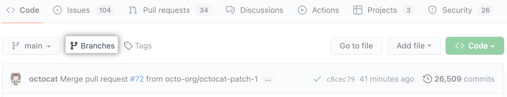
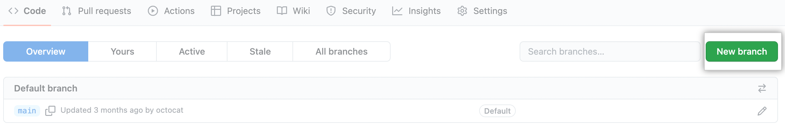
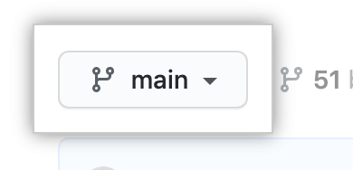
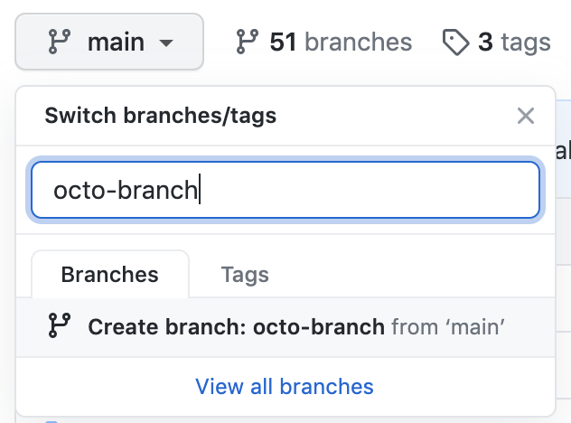
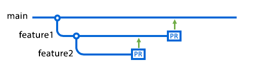
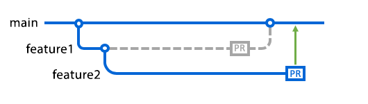
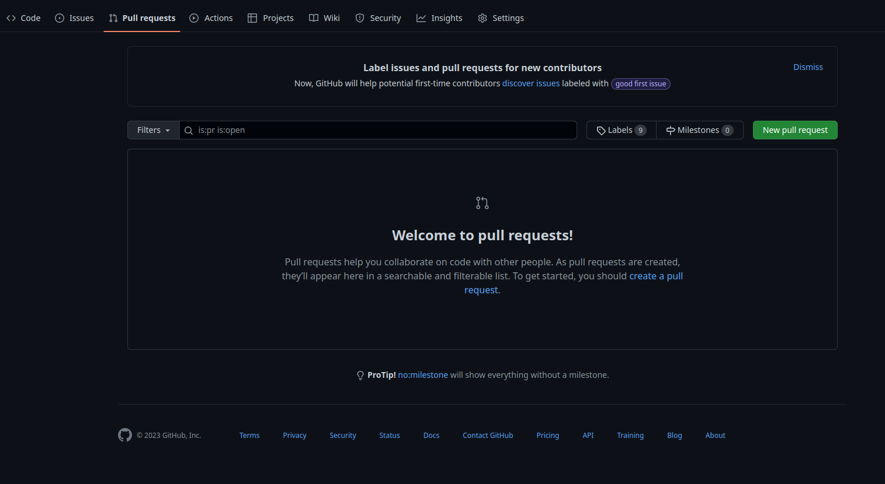
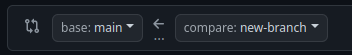
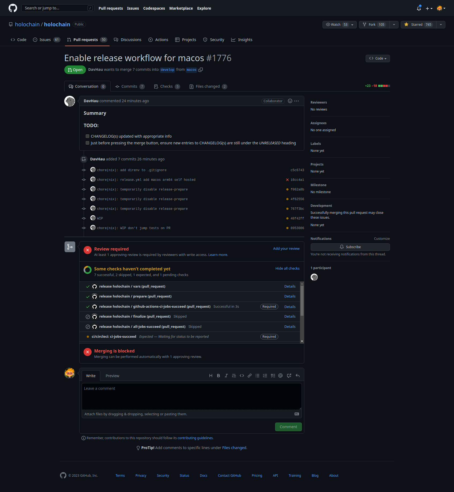

# Branches and Pull Requests

## Branches

A branch is a parallel version of a repository. It is contained within the repository, but does not affect the primary or master branch allowing you to work freely without disrupting the "live" version.

### Branches in GitHub

GitHub allows you to create a branch directly from the repository page. To do this, click the "Branch" button in the top left corner of the repository page. This will open a drop-down menu with a list of branches. Click the "New branch" button to create a new branch.





You can use the branch dropdown menu to switch between branches. You can also create a new branch from the branch dropdown menu.





### Branches in Git

To create a branch in Git, use the `git branch` command. This will create a new branch with the name you specify. For example, to create a branch named `feature-1`, you would run the following command:

```bash
git branch feature-1
```

To switch to the new branch, use the `git checkout` command:

```bash
git checkout feature-1
```

You can also create a new branch and switch to it in one command using the `-b` flag:

```bash
git checkout -b feature-1
```

To delete a branch, use the `git branch -d` command:

```bash
git branch -d feature-1
```

## Pull Requests

Pull requests are proposed changes to a repository submitted by a user and accepted or rejected by a repository's collaborators. Like issues, pull requests each have their own discussion forum.

Pull requests let you tell others about changes you've pushed to a branch in a repository on GitHub. Once a pull request is opened, you can discuss and review the potential changes with collaborators and add follow-up commits before your changes are merged into the base branch.

Here someone has created a branch called feature1 from the main branch, and you've then created a branch called feature2 from feature1. There are open pull requests for both branches. The arrows indicate the current base branch for each pull request. At this point, feature1 is the base branch for feature2. If the pull request for feature2 is merged now, the feature2 branch will be merged into feature1.



In the next diagram, someone has merged the pull request for feature1 into the main branch, and they have deleted the feature1 branch. As a result, GitHub has automatically retargeted the pull request for feature2 so that its base branch is now main.



Now when you merge the feature2 pull request, it'll be merged into the main branch.

### Pull Requests in GitHub

To create a pull request, click the "Pull request" button in the top left corner of the repository page. This will open a page with a list of all open pull requests. Click the "New pull request" button to create a new pull request.



Then you can compare the branches and create the pull request if there is a difference.



Example PR :

